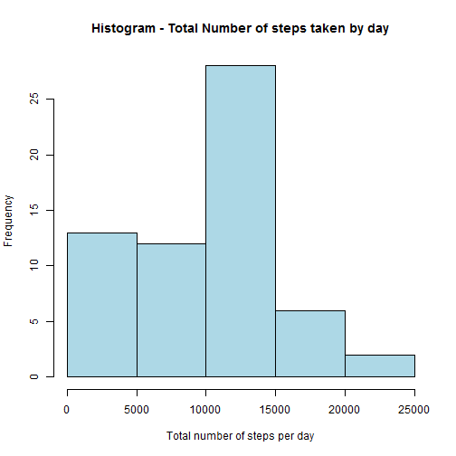
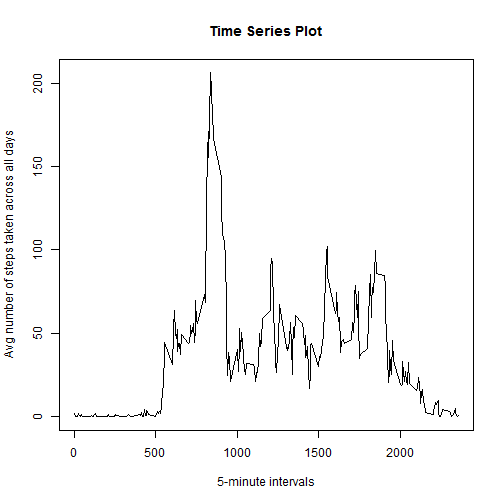
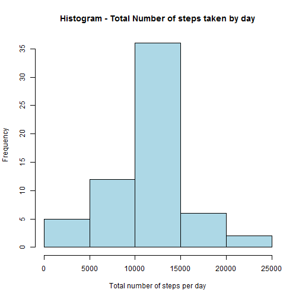
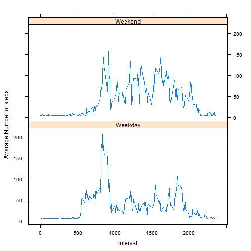

# Reproducible Research: Peer Assessment 1

## Introduction
It is now possible to collect a large amount of data about personal movement using activity monitoring devices such as a Fitbit, Nike Fuelband, or Jawbone Up. These type of devices are part of the "quantified self" movement - a group of enthusiasts who take measurements about themselves regularly to improve their health, to find patterns in their behavior, or because they are tech geeks. But these data remain under-utilized both because the raw data are hard to obtain and there is a lack of statistical methods and software for processing and interpreting the data.

This assignment makes use of data from a personal activity monitoring device. This device collects data at 5 minute intervals through out the day. The data consists of two months of data from an anonymous individual collected during the months of October and November, 2012 and include the number of steps taken in 5 minute intervals each day.

## Data

The variables included in this dataset are:
.steps: Number of steps taking in a 5-minute interval (missing values are coded as NA)
.date: The date on which the measurement was taken in YYYY-MM-DD format
.interval: Identifier for the 5-minute interval in which measurement was taken

The dataset is stored in a comma-separated-value (CSV) file and there are a total of 17,568 observations in this dataset.

## Loading and preprocessing the data

First we need to put data in the directory and set working directory using setwd() function. Then read data and process data in a format suitable for this analysis

```r
# Unzip data
if(!file.exists('activity.csv')){
  unzip('activity.zip')
}
# Read data
activity <- read.csv('activity.csv')
# Format date to date format
activity$date <- as.Date(activity$date , format = "%Y-%m-%d")
head(activity)
```

```
##   steps       date interval
## 1    NA 2012-10-01        0
## 2    NA 2012-10-01        5
## 3    NA 2012-10-01       10
## 4    NA 2012-10-01       15
## 5    NA 2012-10-01       20
## 6    NA 2012-10-01       25
```

## What is mean total number of steps taken per day?

Note : Missing values are ignored. 

1. Calculate the total number of steps taken per day

```r
totsteps_day <- aggregate(activity$steps, by=list(activity$date), sum, na.rm=TRUE)
names(totsteps_day)[2] <- "tot.steps"
names(totsteps_day)[1] <- "date"
head(totsteps_day)
```

```
##         date tot.steps
## 1 2012-10-01         0
## 2 2012-10-02       126
## 3 2012-10-03     11352
## 4 2012-10-04     12116
## 5 2012-10-05     13294
## 6 2012-10-06     15420
```

2. Make a histogram of the total number of steps taken each day

```r
hist(totsteps_day$tot.steps, xlab="Total number of steps per day",
     main="Histogram - Total Number of steps taken by day", col="light blue")
```

 

3. Calculate and report the mean and median of the total number of steps taken per day

```r
mean(totsteps_day$tot.steps)
```

```
## [1] 9354.23
```

```r
median(totsteps_day$tot.steps)
```

```
## [1] 10395
```

## What is the average daily activity pattern?

1. Make a time series plot (i.e. type = "l") of the 5-minute interval (x-axis) and the average number of steps taken, averaged across all days (y-axis)

```r
avgsteps_int <- aggregate(activity$steps, by=list(activity$interval), mean, na.rm=TRUE)
names(avgsteps_int)[1] <- "interval"
names(avgsteps_int)[2] <- "avg.steps"
plot(avgsteps_int$interval, avgsteps_int$avg.steps, type = "n", 
     main = "Time Series Plot", 
    xlab = "5-minute intervals", ylab = "Avg number of steps taken across all days")
lines(avgsteps_int$interval, avgsteps_int$avg.steps, type = "l")
```

 

2. Which 5-minute interval, on average across all the days in the dataset, contains the maximum number of steps?

```r
avgsteps_int[which.max(avgsteps_int$avg.steps), 1]
```

```
## [1] 835
```

## Imputing missing values

Note that there are a number of days/intervals where there are missing values (coded as NA). The presence of missing days may introduce bias into some calculations or summaries of the data.

1. Calculate and report the total number of missing values in the dataset (i.e. the total number of rows with NAs)

```r
sum(is.na(activity$steps))
```

```
## [1] 2304
```

2. Devise a strategy for filling in all of the missing values in the dataset. The strategy does not need to be sophisticated. For example, you could use the mean/median for that day, or the mean for that 5-minute interval, etc.

We will use average to replace missing values.

3. Create a new dataset that is equal to the original dataset but with the missing data filled in.

```r
library(Hmisc)
activity_nonna <- activity
activity_nonna$steps <- with(activity_nonna, impute(steps, mean))
head(activity_nonna)
```

```
##     steps       date interval
## 1 37.3826 2012-10-01        0
## 2 37.3826 2012-10-01        5
## 3 37.3826 2012-10-01       10
## 4 37.3826 2012-10-01       15
## 5 37.3826 2012-10-01       20
## 6 37.3826 2012-10-01       25
```

4. Make a histogram of the total number of steps taken each day and Calculate and report the mean and median total number of steps taken per day. Do these values differ from the estimates from the first part of the assignment? What is the impact of imputing missing data on the estimates of the total daily number of steps?

Calculate the total Steps per day after replacing missing values with mean.

```r
# Aggregate steps by date using sum
nonna_totsteps_day <- aggregate(activity_nonna$steps, by=list(activity_nonna$date),sum)
names(nonna_totsteps_day)[2] <- "nonna.tot.steps"
names(nonna_totsteps_day)[1] <- "date"
head(nonna_totsteps_day)
```

```
##         date nonna.tot.steps
## 1 2012-10-01        10766.19
## 2 2012-10-02          126.00
## 3 2012-10-03        11352.00
## 4 2012-10-04        12116.00
## 5 2012-10-05        13294.00
## 6 2012-10-06        15420.00
```

Plot Histogram

```r
hist(nonna_totsteps_day$nonna.tot.steps, xlab="Total number of steps per day",
     main="Histogram - Total Number of steps taken by day", col="light blue")
```

 

Calculate and report the mean and median total number of steps taken per day.

```r
mean(nonna_totsteps_day$nonna.tot.steps)
```

```
## [1] 10766.19
```

```r
median(nonna_totsteps_day$nonna.tot.steps)
```

```
## [1] 10766.19
```

Replacing missing value with mean has increased estimates of the total daily number of steps.

## Are there differences in activity patterns between weekdays and weekends?

1. Create a new factor variable in the dataset with two levels - "weekday" and "weekend" indicating whether a given date is a weekday or weekend day.

```r
# Create weekday function
wday <- function(date) {
  if (weekdays(as.Date(date)) %in% c("Saturday", "Sunday")) {
    "Weekend"
  } else {
    "Weekday"
  }
}
# Add weekdays type to data
activity_nonna$wday <- as.factor(sapply(activity_nonna$date, wday))
```

2. Make a panel plot containing a time series plot (i.e. type = "l") of the 5-minute interval (x-axis) and the average number of steps taken, averaged across all weekday days or weekend days (y-axis).

```r
# Aggregate steps by day type and interval using mean
avgsteps_int1 <- aggregate(activity_nonna$steps, by = list(activity_nonna$wday, 
    activity_nonna$interval), mean, na.rm = TRUE)
names(avgsteps_int1)[1] <- "weekday"
names(avgsteps_int1)[2] <- "interval"
names(avgsteps_int1)[3] <- "avg.steps"
# Create panel chart using lattice plot
library(lattice)
xyplot(avgsteps_int1$avg.steps ~ avgsteps_int1$interval | 
    avgsteps_int1$weekday, layout = c(1, 2), type = "l", xlab = "Interval", 
    ylab = "Average Number of steps")
```

 
